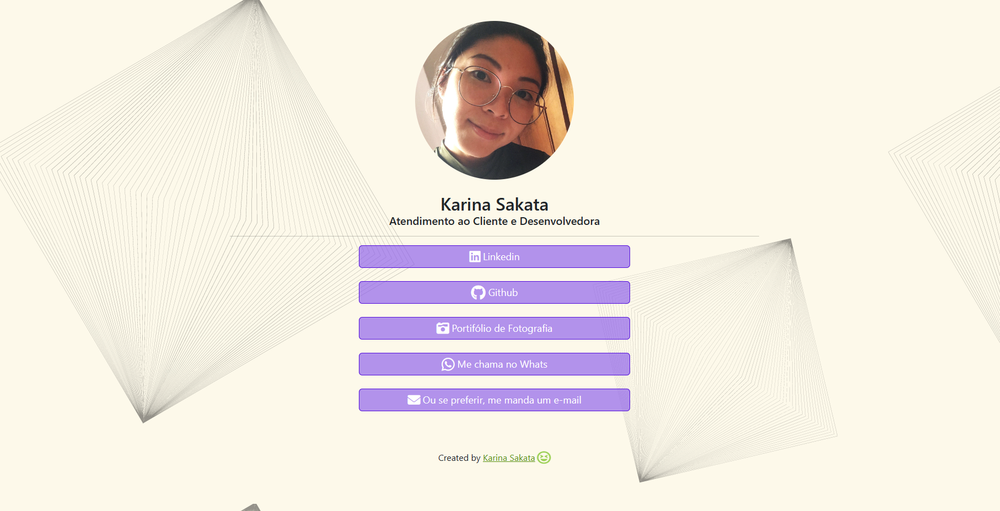

<h1 align="center">Modelo de Cartão de Visita Digital</h1>

O cartão de visita digital é uma ferramenta que contém dados como nome, telefone, endereço, e-mail, site e páginas nas redes sociais, dentre outras informações pertinentes para cada usuário.

O cartão de visita pode ser uma ótima maneira de se auto-divulgar. Melhor ainda se for digital! 

## Sobre

Este cartão de visita foi desenvolvido utilizando HTML, CSS e Bootstrap.

Abaixo você pode ver o template. 

Faça uma visita ao meu cartão [clicando aqui](https://karinamsakata.github.io/cartao-de-visita/) :point_left:
## Para Personalizar

Caso deseje utilizar esta versão e adaptá-la ao seu perfil/negócio, siga os passos abaixo:

:one: Clone este repositório utilizando: 
* git clone git@github.com:KarinaMSakata/cartao-de-visita.git

:two: Abra o arquivo 'cartao-de-visita' em seu editor de código. 

:three: Modifique as informações necessárias no arquivo index.html e adicione suas imagens dentro da pasta 'img'.

